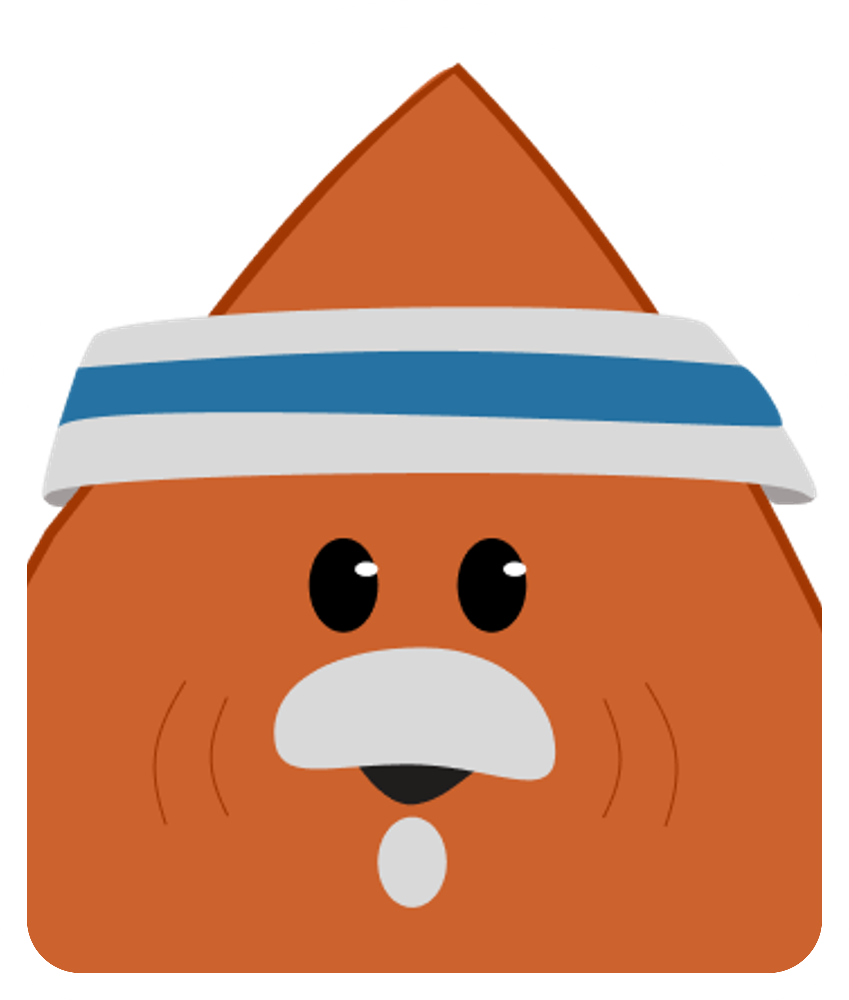
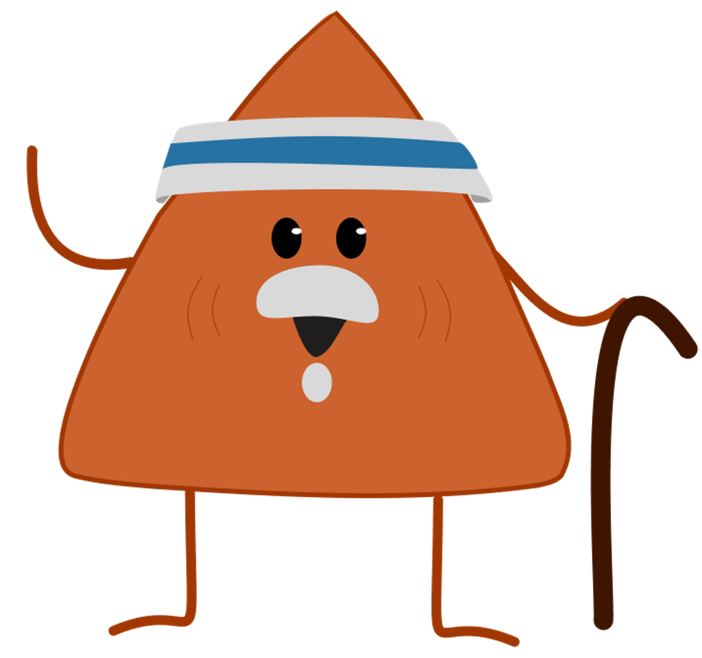
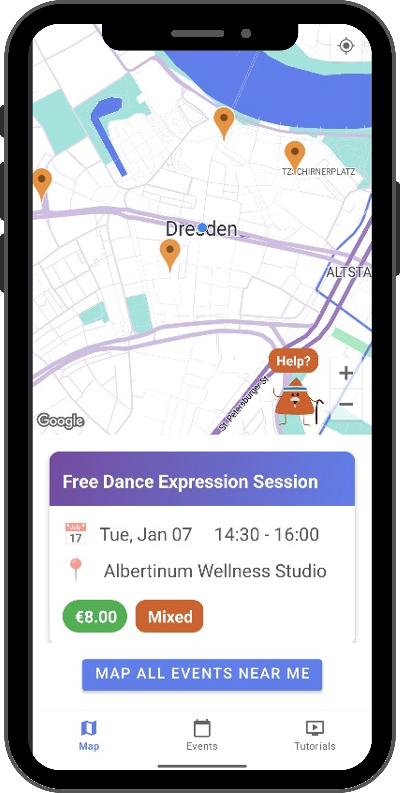
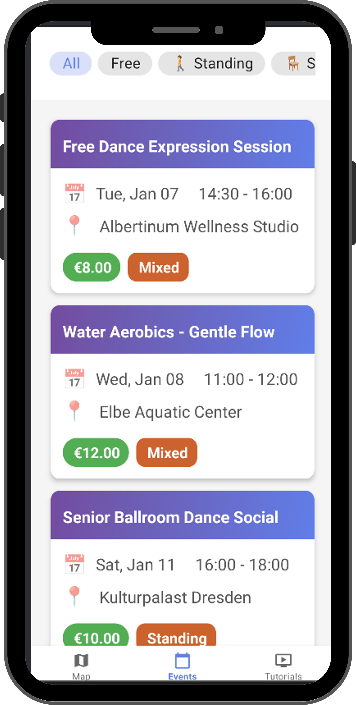
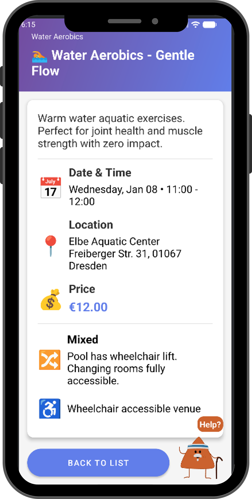
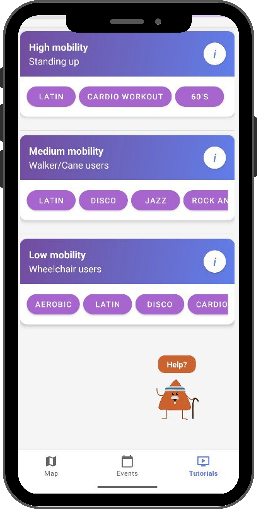

<div align="center">



#  FootLoose

### *Dust off your dancing shoes!*
 
**An accessible Android app for salsa & dance events for seniors in Dresden.**
 
*A TU Dresden — Mobile Cartography project*
 


 
</div>
---
 
## 📖 About
 
Most event-discovery apps assume a young, fully-mobile user. Seniors have different needs: they want to know whether they can sit during the event, if the venue is wheelchair-accessible, whether the dance is performed standing or seated, and they want clear, simple navigation without hidden gestures.
 
**Foot Loose** addresses this gap by placing **mobility and accessibility information at the center** of every event card, every detail screen, and every tutorial recommendation.
 
<div align="center">
  
  <br/>
  <sub><i>Meet <b>Dorito</b> — the triangular help mascot always ready to guide seniors through the app 🔺</i></sub>
</div>
---
 
## ✨ Features
 
### 🗺️ Map view
Browse dance events on an interactive map centered on Dresden, with venue pins and quick access to event details.
 
### 📋 Events list with mobility filters
Filter events by:
- **All events** — see everything available
- **Free events** — no entry fee
- **Standing** — events that involve standing / active dancing
- **Seated** — events performed from a seated position, no mobility restrictions
- **Mixed** — movement expected, but seating available for breaks
Each event card shows the title, date, time, venue, price, and mobility level at a glance.
 
### 📄 Event detail screen
For every event the user can see:
- Event type with icon
- Full description
- Date, start and end time (formatted friendly, e.g. *"Wednesday, Jan 08 • 11:00 - 12:00"*)
- Venue name and address
- Price (distinct **green color** when the event is FREE)
- Mobility level with a clear emoji indicator (🚶 Standing, 🪑 Seated, 🔀 Mixed)
- Specific mobility restrictions written in plain language
- Wheelchair accessibility of the venue
### 💃 Dance tutorials by mobility level
A dedicated tutorials section with curated YouTube videos grouped into three categories:
- **High mobility** — standing dances, full body movement, balance work
- **Medium mobility** — adapted for walker / cane users, gentle rhythmic movement, upper body focus
- **Low mobility** — for wheelchair users, seated choreographies, arm and hand routines
Tutorials can be searched by rhythm name (salsa, bachata, merengue, etc.) or by mobility category.
 
### 🔺 Meet Dorito — the help mascot
Every screen has a triangular **Dorito** help button with a Lottie animation. Tapping it opens a plain-language dialog explaining what the user can do on that screen. This removes guesswork for users who may be less familiar with smartphone UI patterns.
 
---
 
## 📱 Screenshots
 
<p align="center">
  
  
  
  
  
</p>
<div align="center">
  <sub><i>Foot Loose screens — events list with mobility filters, event detail with accessibility info, and tutorials grouped by mobility level.</i></sub>
</div>
---
 
## ♿ Accessibility-first design
 
This isn't a generic app with accessibility bolted on — accessibility **is** the product.
 
| Principle | How we implemented it |
|---|---|
| **Mobility-aware data model** | Every event carries `mobility_level`, `mobility_restrictions`, `wheelchair_accessible`, and `venue_accessible` fields, surfaced directly in the UI. |
| **Plain-language labels** | *"Standing"*, *"Seated"*, *"Mixed"* instead of medical jargon. |
| **Redundant encoding** | Emoji + text + color together, so users can skim visually without relying on any single cue. |
| **Large tap targets** | Material Buttons and Chips with generous padding. |
| **Color coding for critical info** | FREE events in green; price in a distinct secondary color. |
| **Always-visible help** | The Dorito button gives every screen a safety net. |
| **Extended splash screen** (4 s) | Users have time to orient themselves before the main UI appears. |
| **No hidden gestures** | All navigation is through visible buttons and the bottom tab bar. |
 
---
 
## 🛠️ Tech stack
 
| Layer | Technology |
|---|---|
| Language | Java |
| Platform | Android (AppCompat, Fragments) |
| Database | SQLite (pre-built DB shipped in `assets/`) |
| UI components | Material Components (`BottomNavigationView`, `ChipGroup`, `MaterialButton`) |
| Lists | RecyclerView |
| Animations | Lottie |
| Architecture | Single activity + 3 fragments |
 
---
 
## 📁 Project structure
 
```
com.example.maplistpage/
├── SplashActivity.java          # Lottie-animated splash screen
├── MainActivity.java             # Hosts bottom nav + 3 fragments
├── MapFragment.java              # Map view of events in Dresden
├── EventsListFragment.java       # Events list + mobility filter chips
├── EventsAdapter.java            # RecyclerView adapter for events
├── EventDetailActivity.java      # Full event detail screen
├── TutorialsFragment.java        # Dance tutorials by mobility level
├── Event.java                    # Event data model
└── DatabaseHelper.java           # SQLite helper, copies prebuilt DB
```
 
---
 
## 🗄️ Database
 
The app ships with a pre-built SQLite database (`senior_events.db`) in the `assets/` folder, which is copied to device storage on first launch.
 
Main tables:
- **events** — title, description, date, time, price, mobility level, restrictions
- **venues** — name, address, coordinates, wheelchair accessibility
- **event_types** — category with display icon (emoji)
- **dances** — tutorial entries with rhythm name, mobility level, and YouTube URL
---
 
## 🚀 Getting started
 
### Prerequisites
- Android Studio (Hedgehog or newer recommended)
- Android SDK 24+
- A device or emulator running Android 7.0+
### Build & run
```bash
git clone https://github.com/leslybautista/Footlose.git
cd Footlose
```
 
Open the project in Android Studio, let Gradle sync, and run on your device or emulator. The prebuilt database in `app/src/main/assets/senior_events.db` is copied automatically on first launch by `DatabaseHelper`.
 
---
 
## 🌍 Context
 
This project focuses on **Dresden, Germany**, where there is an active community of seniors interested in dance as both social activity and physical exercise. All event data, venues, and coordinates are set for the Dresden area.
 
Developed as part of the **Mobile Cartography** course at **TU Dresden**.
 
---
 
## 🗺️ Roadmap
 
- [ ] German language localization (currently English only)
- [ ] Larger font size setting for users with low vision
- [ ] High-contrast theme
- [ ] Improved TalkBack / screen reader support
- [ ] Event reminders & calendar integration
- [ ] Favorites & personal event list
- [ ] Offline maps for the Dresden area
- [ ] User reviews of venue accessibility
---
 
## 👥 Team
 
Built with 💜 by:
 
- **Beatriz Oliveira de Carvalho**
- **Betty Selena Castro Benavides**
- **Lesly Bautista Buendia** — [@leslybautista](https://github.com/leslybautista)
- **Madzie (Madeleine) Boyles**
*TU Dresden — Mobile Cartography*
 
---
 ## 📄 License

This project is licensed under the **MIT License** — see the [LICENSE](LICENSE) file for details.
## 📄 License
